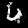
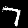

# Pytorch Implementation of Generative Adversarial Nets (GAN)

This is my take on the implementation of GAN [1], using Pytorch [2]. I used MNIST [3] for training and testing.

As I'm an active learning student, this implementation may not be complete or accurate. Therefore, I recommend you to use other reliable implementations if you're willing to use it in your project.

If you find any bugs or flaws, please let me know. Also, I tried using the IEEE style citation, just for practicing. If you think any of the citations are improper, please let me know.

## Model Outputs

Here, I'll present 10 images for each model trained with the different numbers of epochs. I trained them on [Google Colab](https://colab.research.google.com/drive/1Z0GlP7k8R_qE85VcCuArJxAW9eNLM9w9?usp=sharing). However, due to some manual editings, codes on Colab may differ from codes on Github. **Codes on Github always takes precedence.**

### 10-epochs

### 100-epochs

## Pretrained Models

You can download them from `Models` folder.

## Conclusion

During training, I found that Dropout [4] is essential for preventing models from collapsing. However, I'm not sure about the effects of other modifications, such as maxout activation [5], which may be due to my lack of knowledge.

## References

- [1] I. J. Goodfellow et al., "Generative Adversarial Nets," 2014, *arXiv:1406.2661v1*.
- [2] A. Paszke et al., "PyTorch: An Imperative Style, High-Performance Deep Learning Library," in *Advances in Neural Information Processing Systems 32*, 2019, pp. 8024-8035.
- [3] Y. LeCun, L. Bottou, Y. Bengio, and P. Haffner, "Gradient-based learning applied to document recognition," *Proceedings of the IEEE*, vol. 86, no. 11, pp. 2278-2324, Nov. 1998.
- [4] N. Srivastava, G. Hinton, A. Krizhevsky, I. Sutskever, and R. Salakhutdinov, "Dropout: A Simple Way to Prevent Neural Networks from Overfitting," *Journal of Machine Learning Research*, vol. 15, no. 1, 2014, pp. 1929-1958.
- [5] I. J. Goodfellow, M. Mirza, A. Courville, and Y. Bengio, "Maxout Networks," in *International Conference on Machine Learning*, 2013, pp. 1319-1327.